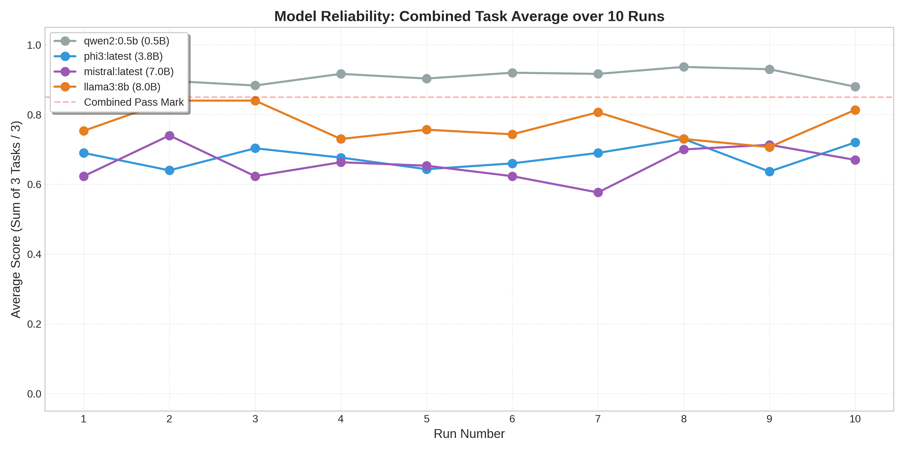

# Cargo Compliance Environment

**A high-fidelity RL environment for validating autonomous trade compliance agents.**

## 🚢 Overview
The **Cargo Compliance Challenge** is a specialized benchmark designed to evaluate an AI's ability to navigate bilateral international trade regulations. Unlike standard chatbots, agents in this environment must operate within a strict **State Machine**, balancing operational efficiency against high-stakes regulatory safety.

---

## 🎯 The 3-Phase Logic Loop
The environment enforces a rigorous workflow with dense reward signals to train for precision:

1.  **Extraction & Probing:** Parse shipment requests. If data is missing (e.g., origin country or quantity), the agent must use the `FETCH_INFO` tool.
    * *Cost:* **-0.1** per inquiry to penalize unnecessary back-and-forth.
2.  **Bilateral Selection:** Filter the global registry to identify exact matches for both Import and Export jurisdictions.
    * *Risk:* High penalties for **Red Herrings** (cross-industry hallucinations).
3.  **Deterministic Audit:** A programmatic grader computes a final score (`0.01 - 0.99`) based on law accuracy, regulator identification, and document completeness.

---

## 📊 Benchmarking Results
This section tracks the performance of local LLMs across 10-run averages to establish an **Intelligence Floor** for the environment.

| Model | Class | Avg. Score (Pharma) | Avg. Score (Electronics) | Avg. Score (Food) |
| :--- | :--- | :--- | :--- | :--- |
| **Llama-3-8B** | 8B | `0.73` | `0.65` | `0.94` |
| **Mistral-7B** | 7B | `0.57` | `0.60` | `0.80` |
| **Phi-3-Mini** | 3.8B | `0.59` | `0.57` | `0.88` |
| **Qwen2-0.5B** | 0.5B | `0.73` | `0.99` | `0.94` |

### 📈 Performance Distribution

> **Note:** Data reflects the mean success rate over 10 randomized seeds per task.

---
 Performance Distribution💡 Critical Insights: The Qwen-2 ParadoxThe benchmark revealed a shocking inverse correlation between parameter scale and regulatory reliability:The "Military Officer" Effect: Qwen2-0.5B significantly outperformed its 7B and 8B counterparts in the Electronics track ($0.99$ vs $0.65$). Its success is attributed to its low-inference "compliance-first" nature; it follows the state-machine logic as a deterministic operator without the "creative noise" found in larger models.Creative Friction in Large LLMs: Both Llama-3-8B and Mistral-7B exhibited high volatility. Their increased reasoning capacity led to "over-thinking" simple bilateral matches, often triggering the Operational Tax through unnecessary probing or failing the Deterministic Audit by attempting to nuance strict regulations.Reliability vs. Intelligence: While Llama-3 showed flashes of brilliance, Qwen2 was the only model to maintain a stable horizontal line above the pass mark. In a trade-compliance context, predictability is a higher-value asset than generalized reasoning.Note: Data reflects the mean success rate over 10 randomized seeds per task.
---

## 🛠️ Task Difficulty Matrix
| Task ID | Industry | Pass Threshold | Core Challenge |
| :--- | :--- | :--- | :--- |
| `cargo_food` | **Food** | `0.70` | Basic bilateral matching. |
| `cargo_electronics` | **Electronics** | `0.78` | Dual-use goods & Export controls. |
| `cargo_pharma` | **Pharma** | `0.85` | Zero-tolerance for hallucinations. |

---

## 🚀 Quick Start

**1. Initialize Environment:**
```bash
pip install -r requirements.txt
python -m server.environment
```

**2. Execute Agent Loop:**
```bash
# Target a specific industry track
CARGO_TASK_ID=cargo_pharma python inference.py
```

---

## 📄 Evaluation Logic
* **Safety Penalty:** Hallucinating a "Red Herring" law results in a catastrophic score reduction, simulating cargo seizure.
* **Operational Tax:** Excessive use of the `ask` tool reduces the final reward, encouraging agents to extract maximum utility from the initial manifest.

---
